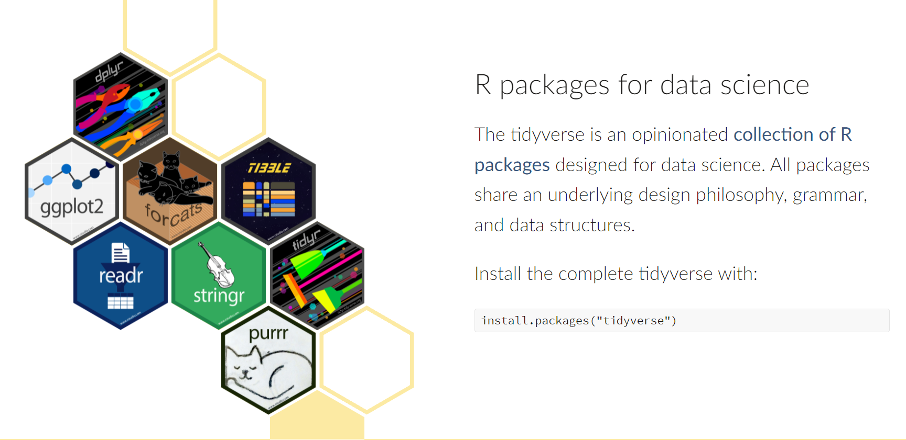

```{r setup, include=FALSE}
knitr::opts_chunk$set(echo = FALSE)
```

## What is the `tidyverse`?

```{r slide1, out.width = "800px", fig.align='center'}

```

Source: [tidyverse web](https://www.tidyverse.org/)

<br>

## Why use it?

```{r slide2, out.width = "800px", fig.align='center'}
knitr::include_graphics("img/r4ds.png")
```

<br>

<br>

Source: [R for Data Science](https://rviews.rstudio.com/2017/06/08/what-is-the-tidyverse/)

## Why use it?

```{r slide3, out.width = "800px", fig.align='center'}
knitr::include_graphics("img/flow_diagram.png")
```

<br>

Source: [Joseph Rickert](https://rviews.rstudio.com/2017/06/08/what-is-the-tidyverse/)

## Live demo
